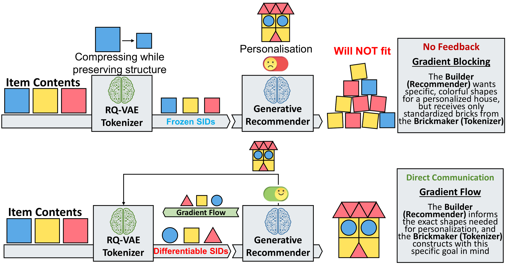
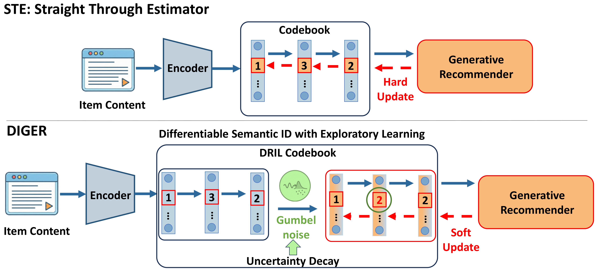

# DIGER: Differentiable Semantic ID for Generative Recommendation

This work has been **accepted as a full paper** at **SIGIR 2026**.


<a href="https://arxiv.org/abs/2601.19711" alt="arXiv"></a>
<a href="https://mp.weixin.qq.com/s/Cs2kwRR0U94GyT5h7hkldg" alt="Chinese blog"></a>



*Figure 1. Conventional pipeline (a) freezes RQ-VAE semantic IDs, while differentiable semantic IDs (b) enable joint optimization for recommendation (Paper Figure 1).*



*Figure 3. DIGER framework compared with STE. DRIL adds stochastic exploration with Gumbel noise and uncertainty decay enables a stable exploration-exploitation transition (Paper Figure 3).*

## Overview

DIGER studies differentiable semantic IDs for generative recommendation. This release contains the code, processed data, semantic embeddings, and RQ-VAE checkpoints needed to reproduce the paper rows for:

- **FrqUD**: frequency-based uncertainty decay.
- **SDUD**: standard-deviation uncertainty decay.
- **SDUD+FrqUD**: the combined setting.

The released scripts cover all three datasets used in the table: Beauty, Instruments, and Yelp.

## Repository Structure

```text
DIGER/
├── main.py
├── model.py
├── trainer.py
├── vq.py
├── data.py
├── config/
│   ├── beauty_jo.yaml
│   ├── instruments_jo.yaml
│   └── yelp_jo.yaml
├── dataset/
│   ├── beauty/
│   ├── instruments/
│   └── yelp/
├── rqvae_ckpt/
│   ├── beauty/best_collision_model.pth
│   ├── instruments/best_collision_model.pth
│   └── yelp/best_collision_model.pth
├── scripts/
│   ├── check_artifacts.py
│   ├── run_experiment.sh
│   ├── run_table_two_gpus.sh
│   ├── run_rqvae_pretrain.sh
│   ├── rqvae/
│   │   ├── main.py
│   │   ├── datasets.py
│   │   ├── trainer.py
│   │   ├── utils.py
│   │   ├── verify_rqvae_ckpt.py
│   │   └── models/
│   └── verify_results.py
├── run_FrqUD.sh
├── run_SDUD.sh
├── run_SDUD_FrqUD.sh
├── run_rqvae_beauty.sh
├── run_rqvae_instruments.sh
├── run_rqvae_yelp.sh
├── run_rqvae_all.sh
└── run_reproduce_table.sh
```

Large release artifacts, including checkpoints, embeddings, and JSONL splits, are tracked with Git LFS.

## Requirements

```bash
conda create -n diger python=3.12.11 -y
conda activate diger
pip install -r requirements.txt
```

Reference environment used for the released paper logs:

- Python 3.12.11
- PyTorch 2.5.1
- Transformers 4.57.1
- Accelerate 1.10.1
- NumPy 2.3.1

Using newer major versions can change initialization and dropout RNG streams. A quick sanity check for the paper environment is the first Yelp SDUD+FrqUD training line:

```text
[Simple Uncertainty] sigma=2.0000, Loss=5.4814
```

If this line is closer to `Loss=5.5120`, the code and artifacts are likely correct but the active Python environment is not the paper environment.

After cloning the repository, pull the LFS files:

```bash
git lfs install
git lfs pull
```

Then verify the released artifacts:

```bash
python scripts/check_artifacts.py
```

## Data

Each dataset directory contains JSONL interaction splits, an item-id map, and the semantic embedding matrix used by the released configs:

```text
dataset/<dataset>/
├── <dataset>.train.jsonl
├── <dataset>.valid.jsonl
├── <dataset>.test.jsonl
├── <dataset>.emb_map.json
└── <Dataset>.emb-llama.npy
```

The loader expects each JSONL row to contain `inter_history` and `target_id`.

## Reproduction

Run one experiment:

```bash
bash scripts/run_experiment.sh beauty frqud
bash scripts/run_experiment.sh instruments sdud
bash scripts/run_experiment.sh yelp both
```

If you keep the paper environment outside your current shell, point the script at its `bin` directory:

```bash
DIGER_ENV_BIN=/path/to/env/bin bash scripts/run_experiment.sh yelp both
```

The same variable works for the full-table launcher:

```bash
DIGER_ENV_BIN=/path/to/env/bin bash run_reproduce_table.sh
```

Convenience wrappers default to Beauty and accept the dataset as the first argument:

```bash
bash run_FrqUD.sh beauty
bash run_SDUD.sh instruments
bash run_SDUD_FrqUD.sh yelp
```

Run the full paper table on at most two single-GPU processes. The worker script uses a shared task queue, so whichever GPU finishes first takes the next experiment:

```bash
bash run_reproduce_table.sh
```

By default this uses GPU `0` and GPU `1`. To choose another pair:

```bash
GPU_LIST="2 3" bash run_reproduce_table.sh
```

By default, `run_reproduce_table.sh` starts a fresh queue by resetting `reproduction_logs/table_queue.state`. To resume an interrupted queue, set:

```bash
RESUME_QUEUE=1 bash run_reproduce_table.sh
```

Training logs are written to `logs/<dataset>/`; stdout mirrors are written to `reproduction_logs/`. Model checkpoints are written to `myckpt/<dataset>/`.

## RQ-VAE Pretraining (Stage-2 Checkpoint Reproduction)

This repository also includes the original Stage-2 RQ-VAE pretraining implementation from `scripts/rqvae/`, so the ckpt release can be reproduced from embeddings.

Default hyper-parameters:

- `lr=1e-3`, `weight_decay=1e-4`
- `epochs=10000`
- `batch_size`: beauty 1024, instruments 2048, yelp 4096
- `num_emb_list=[256,256,256]`
- `layers=[2048,1024,512]`
- `e_dim=256`, `beta=0.25` (beauty/instruments), `beta=0.5` (yelp)
- `sk_epsilons=[0.003,0.003,0.003]`, `sk_iters=50`
- `vq_type=vq`, `loss_type=mse`, `dist=l2`, `kmeans_init=True`

Run one dataset:

```bash
bash scripts/run_rqvae_beauty.sh
bash scripts/run_rqvae_instruments.sh
bash scripts/run_rqvae_yelp.sh
```

Run all three sequentially:

```bash
bash scripts/run_rqvae_all.sh
```

Or if you already have an embedding file for one dataset, jump directly:

```bash
bash scripts/run_rqvae_from_embedding.sh --embedding /path/to/Beauty.emb-llama.npy
bash scripts/run_rqvae_from_embedding.sh --embedding /path/to/custom_embedding.npy --dataset beauty
```

或者直接用一条完整复现脚本（推荐）：

```bash
bash scripts/reproduce_rqvae_stage2.sh --embedding /path/to/Beauty.emb-llama.npy --dataset beauty
bash scripts/reproduce_rqvae_stage2.sh --embedding /path/to/custom_embedding.npy --dataset yelp --gpu 0,1
bash scripts/reproduce_rqvae_stage2.sh --emb-dir /path/to/dataset
bash scripts/reproduce_rqvae_stage2.sh --all --gpu 0,1
```

GPU control (important):

```bash
RQVAE_GPU="0" bash scripts/run_rqvae_from_embedding.sh --embedding ...
RQVAE_GPU="0,1" bash scripts/run_rqvae_from_all_embeddings.sh
```

The runner accepts one or two GPU ids and will stop with an error if more than two are requested.

原版实现与路径定位：

- 该仓库用于复现的 `scripts/rqvae/*` 主体与 `main.py/trainer.py/datasets.py/utils.py/models/*` 在逻辑上与
  `/data/junch/ETEGRec_ONE_Stage/RQVAE/*` 保持同源；`main`、`trainer`、`datasets`、`utils`、`models/rq.py`、`models/layers.py`、`models/rqvae.py`、`models/vq.py` 均已按原实现对齐。
- 在 `MM_ONE_STAGE_GENREC` 的历史配置里，论文主线三组 ckpt 也主要引用了
  `/data/junch/ETEGRec_ONE_Stage/RQVAE/rqvae_ckpt/<dataset>_strong_sinkhorn/...`。
  例如：
  - `run_beauty_standard_gumbel.sh` / `run_beauty_e2e_adaptive.sh` 中 `RQVAE_INIT` 指向 `.../beauty_strong_sinkhorn/Nov-03-2025_16-13-56/best_collision_model.pth`
  - `run_instruments_deterministic.sh` 中 `RQVAE_INIT` 指向 `.../instruments_strong_sinkhorn/Dec-04-2025_14-48-43/best_collision_model.pth`
  - `run_yelp_standard_gumbel.sh` / `run_yelp_adaptive_dynamic_sigma.sh` 中 `RQVAE_INIT` 指向 `.../yelp_strong_sinkhorn/Dec-07-2025_20-22-35/best_collision_model.pth`

复现完成后建议立刻做一键确认（会对比三组ckpt的超参、epoch/collision、以及 strict 模式下的 hash）：

```bash
python3 scripts/rqvae/compare_rqvae_ckpt.py --ckpt_root ./rqvae_ckpt --baseline_root /data/junch/ETEGRec_ONE_Stage/RQVAE/rqvae_ckpt --expect_hash --strict
```

Run all three default embeddings from the repo in one go:

```bash
bash scripts/run_rqvae_from_all_embeddings.sh
``` 

All runners copy the newest `best_collision_model.pth` to:

```text
rqvae_ckpt/<dataset>/best_collision_model.pth
```

Notes on source parity:

- `scripts/rqvae/` in this repo is the core Stage-2 pretraining implementation used for the released checkpoints.
- The code was cross-checked against `/data/junch/ETEGRec_ONE_Stage/RQVAE` and is aligned with its core Stage-2 files (`main.py`, `trainer.py`, `datasets.py`, `models/{rqvae.py,vq.py,layers.py,utils.py}`).
- In historical paper runs, `MM_ONE_STAGE_GENREC` typically loads Stage-2 checkpoints from `/data/junch/ETEGRec_ONE_Stage/RQVAE/rqvae_ckpt/<dataset>_strong_sinkhorn/.../best_collision_model.pth`.

If you need to reproduce the same checkpoint lineage from a custom embedding, point `RQVAE_CKPT_ROOT` explicitly:

```bash
RQVAE_CKPT_ROOT=/your/ckpt/root RQVAE_EPOCHS=20000 \
  bash scripts/run_rqvae_from_embedding.sh --embedding /path/to/your_llm_embedding.npy --dataset beauty
```

The script copies the best checkpoint to:

```text
${RQVAE_CKPT_ROOT}/beauty/best_collision_model.pth
```

Check that your Stage-2 ckpt metadata matches the released setup:

```bash
python scripts/rqvae/verify_rqvae_ckpt.py
```

## Paper Data

The paper reports these metrics (R@5/R@10/N@5/N@10):

| Dataset | Variant | R@5 | R@10 | N@5 | N@10 |
| --- | --- | ---: | ---: | ---: | ---: |
| Beauty | DIGER (FrqUD) | 0.0440 | 0.0683 | 0.0294 | 0.0372 |
| Beauty | DIGER (SDUD) | 0.0442 | 0.0657 | 0.0292 | 0.0361 |
| Beauty | DIGER (SDUD+FrqUD) | 0.0439 | 0.0696 | 0.0293 | 0.0376 |
| Instruments | DIGER (FrqUD) | 0.0915 | 0.1138 | 0.0772 | 0.0844 |
| Instruments | DIGER (SDUD) | 0.0905 | 0.1124 | 0.0753 | 0.0823 |
| Instruments | DIGER (SDUD+FrqUD) | 0.0907 | 0.1127 | 0.0758 | 0.0829 |
| Yelp | DIGER (FrqUD) | 0.0266 | 0.0432 | 0.0173 | 0.0227 |
| Yelp | DIGER (SDUD) | 0.0267 | 0.0439 | 0.0171 | 0.0227 |
| Yelp | DIGER (SDUD+FrqUD) | 0.0273 | 0.0437 | 0.0175 | 0.0227 |

After training, compare the newest matching logs with the paper targets:

```bash
python scripts/verify_results.py
```

The verifier scans `logs/*/*.log` and `reproduction_logs/*` (including `.driver.log`) from the current run. It uses a 1% relative tolerance with a small absolute floor for very small metrics.

If you only want to check the packaged reference logs without rerunning experiments, run:

```bash
VERIFY_WITH_BACKUP=1 python scripts/verify_results.py
```

## Citation

```bibtex
@article{fu2026differentiable,
  title={Differentiable Semantic ID for Generative Recommendation},
  author={Fu, Junchen and Ge, Xuri and Karatzoglou, Alexandros and Arapakis, Ioannis and Verberne, Suzan and Jose, Joemon M and Ren, Zhaochun},
  journal={arXiv preprint arXiv:2601.19711},
  year={2026}
}
```
